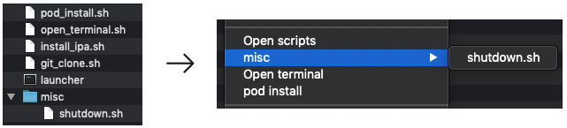

## Executor
Finder extension that automatically displays your scripts in the menu.

### Installation
1. Download the project and run it from Xcode. 
2. Open Finder, right click somewhere and verify that a new option "Open scripts" was added.
3. Click it and yo will see a directory where you can add your scripts. Note that installation automatically adds default files, but you can delete everything except `lancher`.

### Documentation comments
Executor reads content of scripts to determine how and when they should be displayed in the menu.

`# title: hello world`  
specifies title to use in menu for given string. 

`# launcher: [name]`  
launcher is a script that takes another script and runs it, the default one opens Terminal.app
this setting lets you customize launcher for given script. If you want to change it for all your scripts (for example to use different terminal app), just modify the launcher script

`# launcher: none`  
disables launcher - script will be executed without starting terminal

`# ifDirectory: <bool>`  
shows script in menu only if target (file or directory that was right clicked) is / is not a directory

`# ifPasteboard: <text>`  
shows script in menu only if pasteboard contains <text>

`# extensions: <extension>`  
shows script in menu only if target has one of given extensions

`# hasChild: <name>`  
shows script in menu only if target is a directory containing subdirectory or a file with given name

### Contextual scripts
If target folder contains subdirectory named `scripts`, Executor will load scripts from that folder into the menu. This lets you have project specific scripts.
